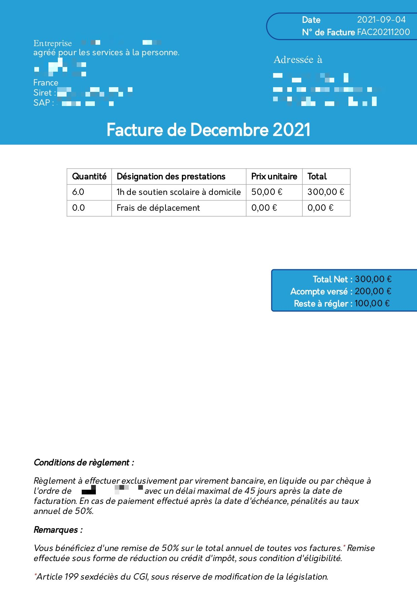

# BillGenerator
Génère des factures et attestations fiscales en pdf à partir de tableaux d'heures de cours.
La génération de PDF est faite à partir de Weasyprint et Jinja2, qui permettent de gérer le style en HTML5/CSS3 en passant des arguments du python vers le HTML

## Installation : 
1. Cloner le projet
2. Installer les bibliothèques et dépendances python avec la commande :
`pip install -r requirements.txt`
3. Exécuter main.py et sélectionner la génération des feuilles de données pour la mise en place automatique des feuilles de comptabilité et de la base de donnée d'élèves.
4. Mettre ses coordonnées dans config/infos_teacher.py 
5. Faites votre compta avec joie :) 

## Utilisation : 
Rentrez dans les feuilles de données pour une case de coordonnées (date, élève), le montant que vous avez été payé.
Puis rentrez votre tarif horraire dans le deuxième onglet.

### Exemple de résultat : 
